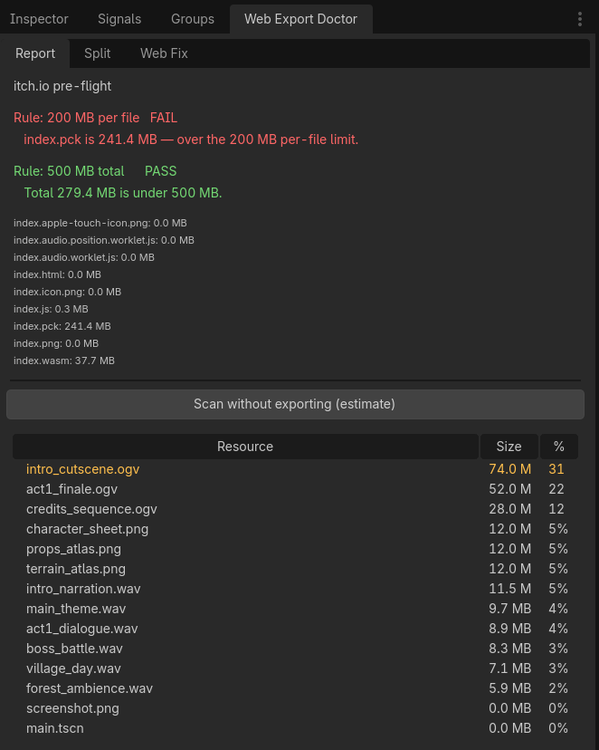

# Web Export Doctor

Tells you whether your Godot HTML5 export will pass itch.io's limits — **before**
you zip and upload, not after.

itch.io enforces two rules on HTML5 games: no single extracted file over
**200 MB**, and no more than **500 MB** extracted in total. Godot packs
everything into one `index.pck`, so a content-heavy project breaks the first
rule with no warning from the editor.



## What it does

### Lite (free, MIT)

**Pre-flight report.** Hooks into the export and afterwards shows two
independent verdicts — one per rule:

```
Rule: 200 MB per file   FAIL
   index.pck is 650.1 MB — over the 200 MB per-file limit.
Rule: 500 MB total      FAIL
   Total 686.6 MB — over the 500 MB limit.
```

Plus a table of the content sorted by size, so you can see what is actually
filling the pack. Click a column header to change sorting.

The **Scan without exporting** button gives a quick estimate over `res://` when
you don't want to wait for a full export.

## Install

1. Extract into `addons/web_export_doctor/` inside your project
2. Project → Project Settings → Plugins → enable **Web Export Doctor**
3. The panel appears in the right dock


## Usage

Export your project for Web as usual. The report fills itself in as soon as the
export finishes. If both rules pass, the zip is ready for itch.io.

If the 200 MB rule fails, splitting into multiple packages is the only way out —
a monolithic `index.pck` cannot be squeezed past it. That's what Pro does.

## Limitations, stated plainly

- Web/HTML5 export only.
- **Your assets are never modified** — no compression, no re-encoding. They are
  read, never written.
- It does write, but only on request: building packages rewrites
  `export_presets.cfg` (see above) and creates the `.pck` files; the Firefox
  workaround edits the exported `index.html`. Nothing is written in the
  background.
- The quick scan is an **estimate**, but a close one. It reads the *imported*
  form of each resource rather than the source file, because that's what
  actually goes into the pack — a 1.5 MB `.wav` becomes a 0.3 MB `.sample`.
  Measured against real exports:

  | project | estimate vs real pack |
  |---|---|
  | official Godot demo (webp, glb, wav) | 0.93–0.96× |
  | PNG textures | 1.01× |
  | raw binary files, no import step | 1.00× |

  Still, a full export is the final word — the estimate can't see the web
  runtime size or export-preset filters.
- A folder that exceeds 180 MB on its own and has no deeper structure can't be
  split automatically — the tool flags it in red instead of quietly building a
  package that will fail.
- Web audio advice changes between engine versions. Treat it as a starting
  point, not a guaranteed fix.

## No server

Everything runs locally in the editor. No telemetry, no license server, no
third-party calls. Works with the internet disconnected.

That isn't just a claim — it's enforced by a test. `run_tests.gd` scans every
script that runs in the editor and fails if any of them mentions `HTTPRequest`,
`HTTPClient`, sockets or `OS.shell_open`.

## Tests

You can run these on your own project. What each one touches is listed, so
nothing is a surprise.

**Read-only** — pure logic, no files written:

```
godot --headless --path . -s addons/web_export_doctor/tools/run_tests.gd
```

**Writes to `build/`** — runs a real web export to compare against the estimate:

```
godot --headless --path . -s addons/web_export_doctor/tools/run_estimate_test.gd
```


## Requirements

- **Godot 4.7+** — developed and verified on 4.7.1 stable
- **Windows** — that's where it has been tested end to end
- Pure GDScript, no external dependencies

### About other platforms and versions

The pre-flight report is plain GDScript and has no reason to behave differently
elsewhere.

Older 4.x versions are likewise untested. Some APIs this addon relies on
(`EditorExportPlatform.export_pack`, how Godot stores `runnable` in
`export_presets.cfg`) changed during the 4.x line.

If you run it on Linux, macOS, or an older 4.x and it works — or doesn't — tell
me and I'll widen the supported range.

## License

Lite: MIT. Pro: proprietary, single user, unlimited projects.